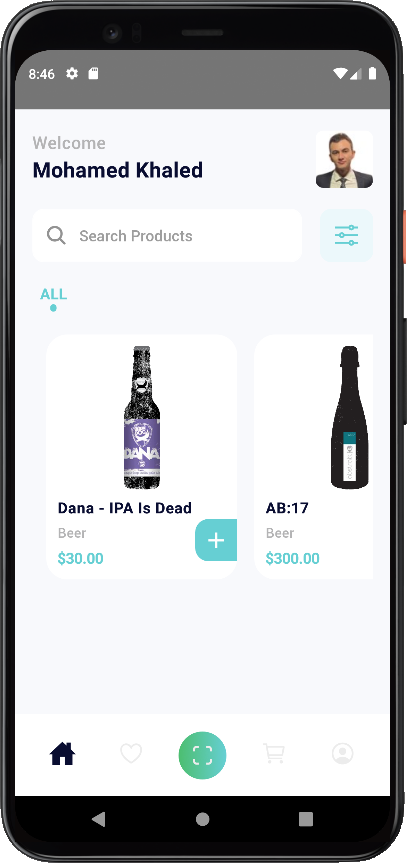
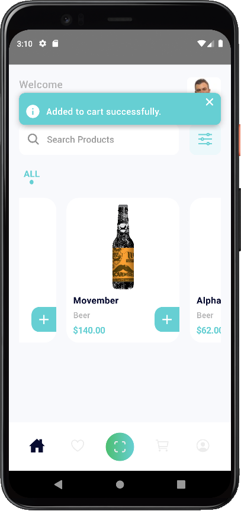

## Punk

This is a sample React-Native project of two screens. <br />
This project is tested only on Android. <br />
[Design](https://www.uplabs.com/posts/grocery-app-ios-mobile-ui-kits-food-delivery-app)
[API](https://punkapi.com/documentation/v2)

## Getting Started

First, run the development server:

```bash
npm install
npm run android
# or
yarn install
yarn run android
```

## Screenshots



